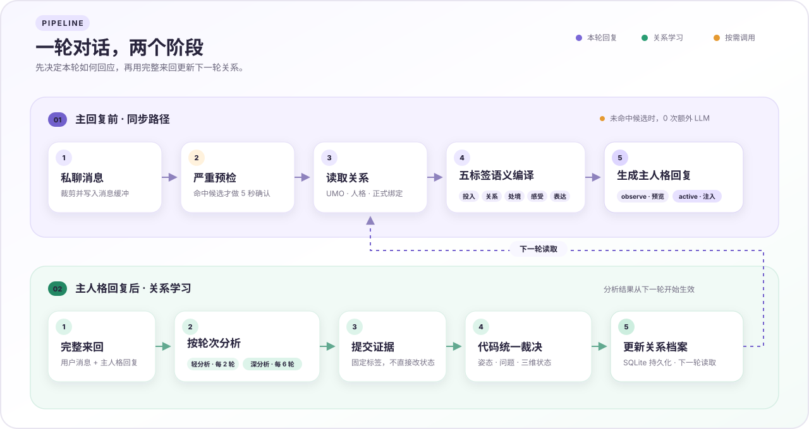

<div align="center">
  
  <h1>CompanionLite V2</h1>
  <p><strong>让 Bot 记得你如何对待它，并在下一次开口时真正改变距离、投入与语气。</strong></p>
  <p>面向 AstrBot 私聊场景的轻量情感陪伴与关系演化插件。关系可以从陌生走向熟稔，也会因单向索取、冒犯或边界施压而冷却，并在可靠修复后逐步回暖。</p>
  <p>
    <a href="https://github.com/AstrBotDevs/AstrBot"></a>
    <a href="https://github.com/6TBWhite/astrbot_plugin_companion_lite_v2/releases"></a>
    <a href="https://www.python.org/"></a>
    <a href="LICENSE"></a>
  </p>
  <p>
    <a href="#核心能力">核心能力</a> ·
    <a href="#架构一览">架构一览</a> ·
    <a href="#安装与启用">安装使用</a> ·
    <a href="docs/semantic-design.md">语义设计</a> ·
    <a href="CHANGELOG.md">版本变化</a>
  </p>
</div>

## 产品定位

普通好感度只是一串数字，CompanionLite V2 会把关系状态编译成主人格能直接执行的自然语言：这一轮愿意投入多少、站得多近、正在介意什么、内心怎么想，又该怎样表达。它不替代主人格，也不保存用户事实；长期记忆组件可以回答“这个用户是谁、发生过什么”，本插件只负责“现在愿意怎样回应”。

关系分析模型只提交证据，不直接决定姿态、权限或绝对数值。关系升级、修复、三维变化和严重事件例外均由代码统一裁决；主人格最终看到的是简短自然语言，而不是内部评分、事件编号或分析标签。

插件自带完整 WebUI 管理面板：既能像翻阅人物档案一样查看单个会话的关系侧写、互动节奏、语义投影和消息时间线，也能总览、搜索并独立启停全部已知会话；工程诊断默认收起，需要排障时再展开。

当前版本为 `2.1.0`。新安装默认使用 `observe`，只记录、分析并生成预览；确认行为符合预期后再切换为 `active`，让关系上下文进入主模型请求。

## 为什么另做 V2

V1 在多轮重构后已不再适合作为运行基线，因此本项目以独立插件 ID、配置、数据库、命令和 Web 路由重新建立精简模型。

- 小模型观察证据，代码掌握关系状态的最终解释权。
- 三维关系、当前姿态和一个主导问题共同表达长期关系与眼前处境。
- 严重事件在主回复前按需复核，普通消息不增加额外模型调用。
- 主模型只接收五标签自然语言上下文，不读取内部裸状态。
- 插件只写入自己的数据目录，不迁移或修改其他关系、记忆插件的数据。

## 核心能力

| 能力 | 带来的体验 | 默认边界 |
| --- | --- | --- |
| 关系演化 | 陌生、熟悉、长期熟稔不再共用同一种语气；信任与亲和会真实改变回答投入和相处距离 | 关系按完整 UMO 隔离，不把一个窗口的亲近带到另一个窗口 |
| 情感与边界 | Bot 会对持续单向索取、贬低、强迫和边界施压逐步冷淡、拒绝或关门，而不是永远无条件帮忙 | 负向表达保持克制，不主动挑衅或持续攻击 |
| 可靠修复 | 具体承接、解释和改变能够软化姿态；两次独立行为确认后才清除未解决问题 | 泛泛道歉、低置信判断或一次性示好不会立即洗白 |
| 正式关系 | 管理员可为人格绑定唯一正式窗口，允许更自然的关心、偏心和熟稔表达 | 正式身份不覆盖当前边界、未解决问题或其他窗口的普通投入 |
| 分层观察 | 每两个完整来回轻分析一次，每六轮深分析一次，让变化既及时又不过度抖动 | 普通消息在主回复前不额外调用分析模型；模型只提交证据 |
| 可选拒答联动 | 安装 polite_silence 后，私聊拒答时机由 Companion 状态机决定，群聊保留 polite_silence 原概率注入；polite_silence 只负责执行拒答 | 默认关闭；未安装或未开启时零影响 |
| 五维语义 | 将关系编译成 `投入 / 关系 / 处境 / 感受 / 表达`，主人格无需理解分数和内部标签 | 只改变本轮关系上下文，不接管主人格或保存用户事实 |
| 完整 WebUI | 查看关系侧写、六轮节奏、语义预览、消息时间线和工程诊断，并总览管理全部会话 | 新安装默认仅观察；确认预览符合预期后再开启实际注入 |

## 架构一览



图中只保留稳定主线：普通消息在主回复前不会调用分析模型，轻分析与深分析都在主人格回复完成后运行。完整轮次门控、分值阈值、修复与绑定优先级见[语义与状态设计](docs/semantic-design.md)。

## 安装与启用

### 安装

推荐在 AstrBot WebUI 的插件市场中搜索“陪伴Lite V2”并安装。若暂未检索到，可从 [GitHub Releases](https://github.com/6TBWhite/astrbot_plugin_companion_lite_v2/releases) 下载 ZIP，然后在 AstrBot WebUI 中进入“插件 → 安装插件 → 从文件安装”并上传。

也可以在支持仓库地址安装的界面中使用：

```text
https://github.com/6TBWhite/astrbot_plugin_companion_lite_v2
```

运行要求：

- AstrBot `>=4.26.3`
- 可用的默认模型提供商，或单独配置关系分析 Provider
- 私聊会话；群聊不进入关系处理

安装或更新后，请在“插件 → AstrBot 插件”中重载 CompanionLite V2，或重启 AstrBot。

### 首次启用

1. 保持默认 `operation_mode = observe`。
2. 完成几轮私聊，在调试页检查关系侧写、分析证据和下一轮语义预览。
3. 确认其他插件没有向同一轮注入冲突的关系指令。
4. 将 `operation_mode` 切换为 `active` 并重载插件。

`observe` 仍会捕获消息、运行关系分析并保存预览，但不会修改主人格请求。`active` 会加入稳定的 `companion_protocol` 和本轮动态 `companion_state`。

插件数据默认位于：

```text
data/plugin_data/astrbot_plugin_companion_lite_v2/
└── companion_lite_v2.db
```

## 配置

以下配置均可在 AstrBot WebUI 修改，并与 `_conf_schema.json` 保持一致。

| 配置项                      | 默认值       | 说明                                    |
| ------------------------ | ---------:| ------------------------------------- |
| `operation_mode`         | `observe` | `observe` 只分析和预览；`active` 向主人格注入关系上下文 |
| `enable_message_capture` | `true`    | 捕获私聊完整来回                              |
| `min_message_length`     | `1`       | 进入关系消息缓冲的最短字符数                        |
| `max_message_length`     | `400`     | 单条用户消息和主人格回复的入库上限                     |
| `max_buffer_rounds`      | `24`      | 每个 UMO 保留的完整来回数                       |
| `reflection_provider_id` | `""`      | 留空时使用当前默认模型提供商                        |
| `persona_prompt`         | `""`      | 深分析使用的稳定人格参考                          |
| `max_context_chars`      | `340`     | 动态关系上下文预算，可配置范围 `260..340`            |
| `bridge_polite_silence`  | `false`   | 私聊拒答提示由 Companion 状态机接管，群聊保持 polite_silence 原概率注入 |
| `silence_ignore_prompt`  | `""`      | 自定义拒答提示模板，占位符 `{sender_id}`、`{minutes}`；留空用内置 |

### 第三方插件桥接

| 插件 | 接入内容 | 启用与边界 |
| --- | --- | --- |
| [astrbot_plugin_polite_silence](https://github.com/KitsuneiMomo/astrbot_plugin_polite_silence) | 私聊维度：摘除其概率注入，由 Companion 状态机决定何时提示主模型输出 `<ignore>` 拒答；响应侧解析标签并记录拒答事件（累计次数 + 最近一次详情，时长按其实时配置夹取） | `bridge_polite_silence` 默认关闭；仅在 `active` 模式生效，未安装或 observe 模式整条链 no-op；不修改 polite_silence 配置，群聊与关闭陪伴的私聊保持其原概率注入 |

状态机触发时机：`disengaged` 必注入；`guarded` 且存在边界、贬低或胁迫问题（`noticed / expressed`），或 `hold_boundary` 提醒生效时注入；修复期不注入。模型在回复中自主输出 `<ignore id="..." duration="..." />`，polite_silence 负责解析并执行沉默，Companion 同时记录拒答事件，对方在沉默结束后回来时一次性告知主模型沉默时长。

桥接不修改 polite_silence 的任何配置：开启后只把私聊请求中 polite_silence 已注入的提示摘除（尾部精确匹配，失败时回退全串包含匹配），再按状态机决定是否注入 Companion 的拒答提示；群聊与关闭陪伴的私聊完全保持 polite_silence 的原概率注入。已向上游提交“私聊与群聊独立触发概率”的 feature request 与实现草案，合入后将切换为直接关闭私聊概率、摘除逻辑整体移除。

拒答指令与恢复告知追加在 system_prompt 尾部，前缀（人格与固定协议）保持稳定，不影响无注入轮次的 prompt 缓存。也可以在调试页“启停管理 → 联动插件”中直接拨动开关，与 AstrBot 配置面板同源同步。

## 管理员命令

命令只在私聊中使用。

| 命令                  | 功能                           |
| ------------------- | ---------------------------- |
| `/clv2_status`      | 查看当前 UMO 的关系状态、拒答统计和最近编译文本  |
| `/clv2_reset`       | 清空当前 UMO 的关系状态、消息、待处理交互和正式绑定 |
| `/clv2_reflect`     | 尝试运行当前轮次的深分析                 |
| `/companion_bond`   | 将当前窗口设为当前人格唯一正式关系            |
| `/companion_unbond` | 解除当前窗口的正式身份，保留相处状态           |

## 调试页

在 AstrBot WebUI 左侧“插件页面”中打开“陪伴Lite V2”，或访问：

```text
http://<AstrBot 地址>/#/plugin-page/astrbot_plugin_companion_lite_v2/debug
```

页面提供两个视图：

- **关系档案**：查看三维状态、感受追踪、关系侧写（含拒答信号）、六轮互动节奏、五标签语义投影、消息时间线和工程诊断（含拒答事件详情）。
- **启停管理**：总览最多 1000 个已知 UMO，按状态搜索、筛选、排序并逐会话启停；顶部“联动插件”区块提供 polite_silence 桥接开关。

关系档案不会重复提供启停开关。页面每五秒静默同步；同步会保护文字选择、输入焦点、滚动位置、语义页签和折叠状态。

## 项目结构

```text
astrbot_plugin_companion_lite_v2/
├── main.py                 AstrBot 事件钩子与入口，装配核心服务
├── config.py               配置读取与边界归一化
├── core/
│   ├── models.py           关系状态、证据类型与代码裁决
│   ├── storage.py          SQLite 持久化与 UMO 隔离
│   ├── persona.py          人格解析与正式关系判定
│   ├── reflection_service.py  反思调度与执行
│   ├── silence_bridge.py   polite_silence 桥接
│   ├── webui.py            调试页 Web API 与档案管理
│   ├── commands.py         私聊管理命令实现
│   └── web.py              Web 请求/响应适配
├── llm/
│   ├── reflection.py       严重、轻量与深度关系分析
│   └── context_builder.py  五标签语义编译
├── pages/debug/index.html  关系档案与启停管理页面
├── docs/                   语义与状态设计
├── tests/                  状态、提示词、存储与 WebUI 测试
├── _conf_schema.json       AstrBot WebUI 配置定义
└── metadata.yaml           插件市场元数据
```

## 设计与文档

- [语义与状态设计](docs/semantic-design.md)：关系状态、调度、证据裁决、修复、绑定与五标签编译的当前设计契约。
- [项目状态](PROJECT_STATE.md)：当前运行状态、已验证结果和后续检查项。
- [版本变化](CHANGELOG.md)：从早期预览到稳定版的完整演进记录。
- [MIT License](LICENSE)

## 开发验证

在插件目录运行：

```text
python -m pytest -q
python -m ruff check .
```

## 致谢与友链

- [astrbot_plugin_polite_silence](https://github.com/KitsuneiMomo/astrbot_plugin_polite_silence)：礼貌性沉默执行端，桥接目标插件。
- [astrbot_plugin_sylanne](https://github.com/Ayleovelle/astrbot_plugin_sylanne)：实验性的关系演化插件，也是本插件桥接接管方式的参考实现。

<div align="center">
  <a href="https://github.com/AstrBotDevs/AstrBot">AstrBot Plugin</a> ·
  <a href="LICENSE">MIT License</a>
</div>
